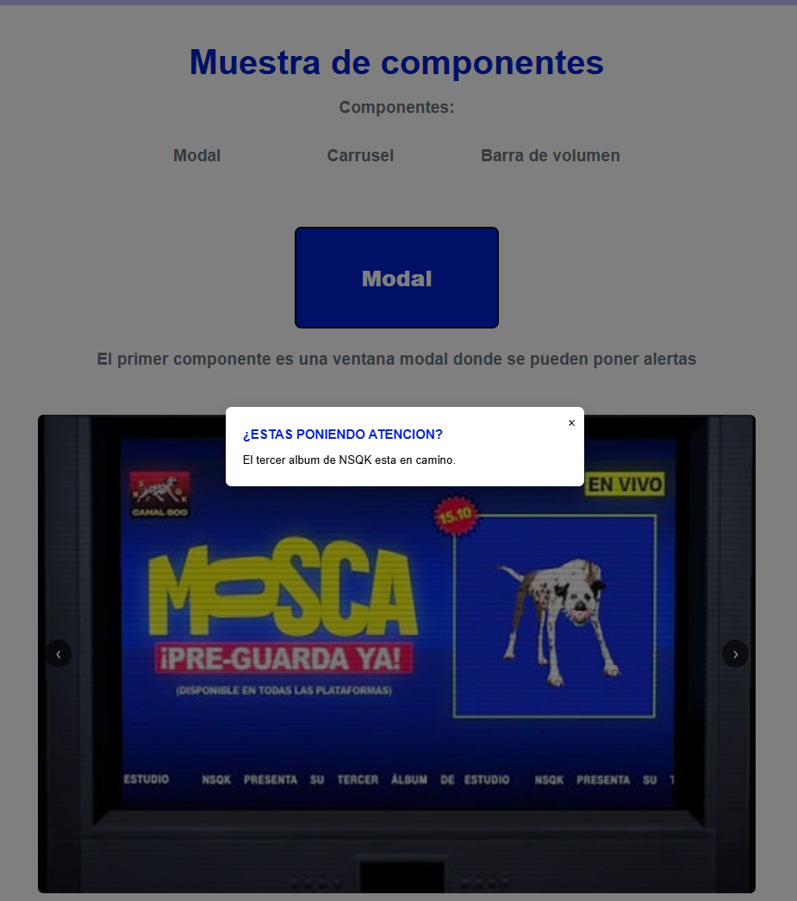

# TECNOLOGICO NACIONAL DE MEXICO
### **INSTITUTO TECNOLOGICO DE OAXACA**
### **Utilería JS - COMPONENTES**
### **Autor** Canseco Reyes Juan Carlos
### **Materia:** Programacion Web
### **Profesor** Martinez Nieto Adelina
**Problema que resuelve:** 
 -MODAL: Resuelve la necesidad de mostrar información crítica, confirmaciones o formularios sin redirigir al usuario a otra página.
 -CARRUSEL: Permiti exhibiR múltiples imágenes dentro de un mismo DIV interactivo, optimizando el diseño visual.
 -BARRA DE VOLUMEN: Permite al usuario ajustar, medir y silenciar el nivel de audio de la pagina de forma intuitiva.
---

## Instalación
Para utilizar esta librería en cualquier proyecto, simplemente enlaza el script en tu documento HTML, preferentemente antes del cierre de la etiqueta `</body>` o en el `<head>` con el atributo `defer`; y para enlazar el CSS en el `<head>` agrega la etiqueta (no es necesario instalar ningun paquete):

```html
    <head>
        <script src="js/componentes.js" defer></script>
        <link rel="stylesheet" href="css/componentes.css">
    </head>

    o
    
    <script src="js/componentes.js"></script> --antes de finalizar el body


```
## Libreria componentes.js

### 1. Modal
El modal sirve para mostrar un mensaje en una ventana que aparece sobre la pagina.

```js
 class Modal {
  constructor(modalElement) {
    this.modal = typeof modalElement === 'string' ? document.querySelector(modalElement) : modalElement;
    this.closeBtn = this.modal.querySelector('.modal-close');
    this._init();
  }

  _init() {
    if (this.closeBtn) {
      this.closeBtn.addEventListener('click', () => this.close());
    }
    this.modal.addEventListener('click', (e) => {
      if (e.target === this.modal) this.close();
    });
  }

  open() {
    this.modal.classList.add('active');
  }

  close() {
    this.modal.classList.remove('active');
  }
}

```
En el archivo HTML construiremos el modal para que se visualize con los componentes que deseemos y een el ejemplo se arrojara al darle click aun boton:
```html
<div class="modal-overlay" id="myModal">
    <div class="modal-container">
      <button class="modal-close">&times;</button>
      <h2>¿ESTAS PONIENDO ATENCION?</h2>
      <p>El tercer album de NSQK esta en camino.</p>
    </div>
  </div>

  <button class="botton" id="openModalBtn">Modal</button>
```
Esto se hace gracias al siguiente script:
```js
const modal = new Modal('#myModal');
    document.getElementById('openModalBtn').addEventListener('click', () => modal.open());
```

### 2. Carrusel de imagenes
Muestra multiples images para optimizar espacio y mejorar el diseño visual
```js
class Carousel {
  constructor(containerElement) {
    this.container = typeof containerElement === 'string' ? document.querySelector(containerElement) : containerElement;
    this.track = this.container.querySelector('.carousel-track');
    this.slides = Array.from(this.track.children);
    this.nextBtn = this.container.querySelector('.carousel-btn.next');
    this.prevBtn = this.container.querySelector('.carousel-btn.prev');
    this.currentIndex = 0;

    this._init();
  }

  _init() {
    if (this.nextBtn) this.nextBtn.addEventListener('click', () => this.next());
    if (this.prevBtn) this.prevBtn.addEventListener('click', () => this.prev());
  }

  _updatePosition() {
    this.track.style.transform = `translateX(-${this.currentIndex * 100}%)`;
  }

  next() {
    this.currentIndex = (this.currentIndex + 1) % this.slides.length;
    this._updatePosition();
  }

  prev() {
    this.currentIndex = (this.currentIndex - 1 + this.slides.length) % this.slides.length;
    this._updatePosition();
  }
}
```

En el archivo HTML construiremos el carrusel con las imagenes que ocuparemos en el
```html
 <div class="carousel-container" id="myCarousel">
    <div class="carousel-track">
      <div class="carousel-slide"></div>
      <div class="carousel-slide"></div>
      <div class="carousel-slide"></div>
      <div class="carousel-slide"></div>
    </div>
    <button class="carousel-btn prev">&#10094;</button>
    <button class="carousel-btn next">&#10095;</button>
  </div>
```
Se inicializa por el siguiente script:
```js
const carousel = new Carousel('#myCarousel');
```
### 3. Barra de volumen
Permite al usuario ajustar, medir y silenciar el nivel de audio de la pagina de forma intuitiva.
```js
class VolumeBar {
  constructor(containerElement, options = {}) {
    this.container = typeof containerElement === 'string' ? document.querySelector(containerElement) : containerElement;
    this.icon = this.container.querySelector('.volume-icon');
    this.wrapper = this.container.querySelector('.volume-slider-wrapper');
    this.fill = this.container.querySelector('.volume-fill');
    this.text = this.container.querySelector('.volume-text');

    this.volume = options.initialVolume ?? 50;
    this.isMuted = false;
    this.lastVolume = this.volume;
    this.onChange = options.onChange || null;

    this._init();
  }

  _init() {
    this.setVolume(this.volume);

    this.wrapper.addEventListener('click', (e) => {
      const rect = this.wrapper.getBoundingClientRect();
      const clickX = e.clientX - rect.left;
      const percentage = Math.max(0, Math.min(100, Math.round((clickX / rect.width) * 100)));
      this.setVolume(percentage);
    });

    if (this.icon) {
      this.icon.addEventListener('click', () => this.toggleMute());
    }
  }

  setVolume(value) {
    this.volume = value;
    this.fill.style.width = `${this.volume}%`;
    if (this.text) this.text.textContent = `${this.volume}%`;
    this._updateIcon();
    
    if (this.onChange) this.onChange(this.volume);
  }

  toggleMute() {
    if (this.isMuted) {
      this.isMuted = false;
      this.setVolume(this.lastVolume || 50);
    } else {
      this.lastVolume = this.volume;
      this.isMuted = true;
      this.setVolume(0);
    }
  }
```

En el archivo HTML construiremos la barra con las imagenes que ocuparemos en el ademas de agregar un video para observar que el video si baja
```html
  <video id="miVideo" src="img/hombredebiennsqk.mp4" width="900" controls></video>
  <div class="volume-control" id="myVolume">
    <span class="volume-icon">🔊</span>
    <div class="volume-slider-wrapper">
      <div class="volume-fill"></div>
    </div>
    <span class="volume-text">50%</span>
        </div><br>
        <p class="subtitulo">El ultimo componente es una barra de volumen para la pagina</p>
  </div>
```
Se inicializa por el siguiente script:
```js
const miVideo = document.getElementById('miVideo');

    // Inicialización de la Barra de Volumen
    const volumeBar = new VolumeBar('#myVolume', {
      initialVolume: 50,
      onChange: (nuevoVolumen) => {
      // Convertimos de 0-100 a 0.0-1.0
      miVideo.volume = nuevoVolumen / 100;
    }
  });
```
## Caputras de Pantalla
### Modal:

### Carrusel:

### Barra de volumen:


## Video
Video de componentes:
